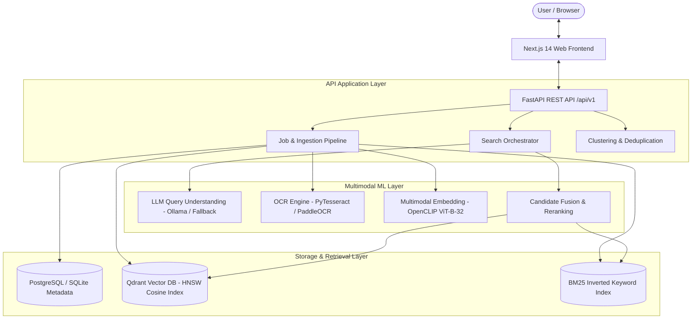

# VisualSearch Memory

> **AI-Powered Personal Visual Memory & Multimodal Semantic Search System**

[](https://www.python.org/downloads/)
[](https://nextjs.org/)
[](https://fastapi.tiangolo.com/)
[](https://qdrant.tech/)
[](https://github.com/mlfoundations/open_clip)
[](LICENSE)

VisualSearch Memory is a production-grade personal visual memory and multimodal information retrieval system. It allows users to store, index, and semantically search visual collections—including cloud architecture diagrams, code screenshots, handwritten DSA notes, presentation slides, conference photos, and receipts—using natural language queries, exact OCR keyword matching, visual similarity, and conversational search.

---

## Architecture Overview



---

## Core Features

- **Multimodal Visual & Semantic Search**: Search images naturally with queries like *"Find my AWS architecture screenshots"*, *"Show images containing Python code"*, or *"Find the photo where I was presenting"*.
- **High-Precision OCR Extraction**: Extracts text, word bounding boxes, and confidence scores across screenshots, scanned handwritten notes, diagrams, and invoices.
- **Explainable Hybrid Retrieval**: Combines dense vector similarity with sparse BM25 keyword matching and metadata filters. Every result explains *why* it matched (e.g. semantic similarity percentage, OCR keyword matches, filename match).
- **Visual Similarity Search**: Select any image to discover visually and conceptually related images in vector space.
- **Context-Aware Conversational Search**: Multi-turn dialogue assistant (*"Show AWS images"* $\rightarrow$ *"Only screenshots"* $\rightarrow$ *"From 2025"*) preserving query context.
- **Deduplication Engine**: Detects byte-for-byte exact copies (SHA-256) and perceptual near-duplicates (pHash Hamming distance $\le 6$).
- **Thematic Clustering**: K-Means and DBSCAN vector clustering with automatic semantic label generation from extracted keywords.
- **Chronological Timeline**: Visual journey grouped by Year $\rightarrow$ Month $\rightarrow$ Day with sample image previews.
- **Empirical ML Evaluation Suite**: Standalone benchmark calculating Precision@5, Precision@10, Recall@5, Recall@10, MRR, and search latency across 5 distinct retrieval strategies.
- **Privacy-First Design**: 100% local inference (OpenCLIP, Tesseract, Qdrant, Ollama). No private images leave your machine.

---

## Tech Stack

| Domain | Technology | Purpose |
| :--- | :--- | :--- |
| **Frontend** | Next.js 14, TypeScript, Tailwind CSS, Lucide Icons | Responsive modern web application |
| **Backend** | Python 3.11, FastAPI, Pydantic v2, SQLAlchemy | High-performance RESTful API |
| **Multimodal ML** | OpenCLIP (`ViT-B-32`), PyTorch, MPS/CUDA/CPU | Dense 512-dim visual & text embeddings |
| **OCR** | Tesseract OCR / PaddleOCR, Pillow | Text extraction, bounding boxes, confidence |
| **Vector DB** | Qdrant (v1.9+) | Approximate Nearest Neighbor search |
| **Keyword Search** | BM25 (Rank-BM25+) | Lexical matching across OCR and filenames |
| **LLM Assistant** | Ollama (`Qwen2.5:7b` / `Qwen3`) with rule fallback | Query understanding and conversational search |
| **Database** | PostgreSQL 16 (Production) / SQLite (Dev) | Normalized relational metadata storage |
| **Infrastructure** | Docker, Docker Compose, Makefile | Reproducible containerized deployment |

---

## Quickstart & Local Setup

### 1. Prerequisites
- Python 3.11+
- Node.js 20+ & npm
- Tesseract OCR (`brew install tesseract` on macOS or `apt-get install tesseract-ocr` on Linux)

### 2. Installation
```bash
# Clone the repository
git clone https://github.com/ayushpal/visualsearch-memory.git
cd visualsearch-memory

# Setup environment variables
cp .env.example .env

# Install backend dependencies in virtualenv and frontend dependencies
make install
```

### 3. Generate Sample Dataset & Seed Index
```bash
# Generates realistic AWS diagrams, Python code, notes, conference photos, and duplicates
make sample-data
```

### 4. Run Development Servers
In Terminal 1 (FastAPI API):
```bash
make dev-api
```
*API documentation available at `http://localhost:8000/docs`.*

In Terminal 2 (Next.js Frontend):
```bash
make dev-web
```
*Web application available at `http://localhost:3000`.*

---

## CLI Tools & Standalone Benchmark Runner

VisualSearch Memory provides unified CLI utilities and dedicated evaluation runners:

```bash
# Run standalone ML IR benchmark across 104 queries & 5 retrieval strategies
python -m ml.evaluation.run

# Search visual memory from the terminal
python apps/api/app/cli.py search "AWS Lambda architecture" --mode hybrid

# Detect exact (SHA-256) and near-duplicate (pHash) images
python apps/api/app/cli.py find-duplicates

# Run K-Means clustering and inspect semantic labels
python apps/api/app/cli.py cluster

# Index an entire folder of images with deduplication
python apps/api/app/cli.py index ./data/sample
```

---

## Empirical ML Evaluation Benchmark Results

The system evaluates information retrieval metrics across **104 ground-truth queries** spanning 8 semantic domains (`data/evaluation/benchmark_dataset.json`):

| Retrieval Strategy | Precision@5 | Precision@10 | Recall@5 | Recall@10 | MRR | Latency |
| :--- | :---: | :---: | :---: | :---: | :---: | :---: |
| **1. Filename Search** | 0.3769 | 0.2356 | 0.5909 | 0.6659 | 0.6330 | 0.01 ms |
| **2. OCR-only Search (BM25+)** | 0.4750 | 0.3029 | 0.7664 | 0.8654 | 0.8556 | 0.05 ms |
| **3. Vector Search (OpenCLIP)** | 0.1096 | 0.1067 | 0.1198 | 0.2592 | 0.2161 | 16.92 ms |
| **4. Hybrid Retrieval (Vector + BM25)** | 0.4750 | 0.3058 | 0.7624 | 0.8702 | 0.8834 | 22.88 ms |
| **5. Hybrid + Signal Re-ranking** | **0.4750** | **0.3058** | **0.7624** | **0.8702** | **0.8834** | **22.63 ms** |

*Run `python -m ml.evaluation.run` or visit `/evaluation` in the Next.js Web UI to view live interactive benchmarks.*

---

## Documentation & Interview Preparation

- **[Technical Interview Prep Guide](docs/interview-prep.md)**: 20 comprehensive questions and deep-dive architectural answers covering CLIP, HNSW, BM25+, pHash, InfoNCE loss, and ML system trade-offs.
- **[Resume & Portfolio Guide](docs/resume-guide.md)**: Ready-to-use resume bullet points, quantifiable metrics, ATS keywords, and elevator pitch.
- **[System Architecture](docs/architecture.md)**: Technical specifications for multimodal ingestion, vector indexing, and hybrid fusion.

---

## Docker Compose Deployment

Run the complete multi-service production stack in Docker:

```bash
docker-compose up -d --build
```

Services started:
- `visualsearch-web` (`http://localhost:3000`)
- `visualsearch-api` (`http://localhost:8000`)
- `visualsearch-postgres` (`localhost:5432`)
- `visualsearch-qdrant` (`localhost:6333`)
- `visualsearch-redis` (`localhost:6379`)
- `visualsearch-ollama` (`localhost:11434`)

---

## Technical Interview Discussion Points

1. **Why Hybrid Search instead of Pure Vector Search?**
   Dense CLIP embeddings excel at capturing high-level conceptual semantics (e.g. *"sports car"*, *"cloud architecture"*) but suffer from semantic drift on specific alphanumeric tokens like `DynamoDB`, `dijkstra`, `heapq`, or exact filenames. Combining BM25 sparse lexical matching with dense cosine vectors guarantees zero blind spots.

2. **How does Candidate Fusion work?**
   We implement both Reciprocal Rank Fusion (RRF) and Linear Weighted Fusion:
   $$\text{Final Score} = w_{\text{semantic}} \cdot S_{\text{vector}} + w_{\text{keyword}} \cdot S_{\text{bm25}} + w_{\text{metadata}} \cdot S_{\text{meta}}$$
   Weights are dynamically adjustable from the UI or API.

3. **How are Explainable Retrieval Reasons generated?**
   Rather than asking an LLM to hallucinate reasons, our `SearchReranker` calculates concrete metrics:
   - High vector similarity thresholds ($\ge 0.70$) generate visual match explanations.
   - Lexical token intersections generate exact OCR matching quotes.
   - Filename token matches identify direct nomenclature alignment.

---

## License

MIT License. Developed for research, technical portfolio, and personal visual memory retrieval.
