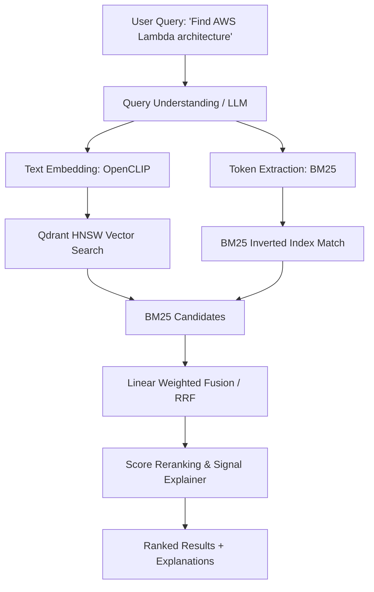

# Search & Hybrid Retrieval Architecture

## Retrieval Modes
1. **Semantic Search**: Uses OpenCLIP text-image embeddings to find visually and conceptually similar memories.
2. **OCR Search**: Uses BM25 to find exact keyword matches within extracted text.
3. **Hybrid Search**: Combines semantic embeddings with OCR text matching and metadata signals.
4. **Similar Image Search**: Uses an image's own visual embedding vector as the query vector to discover similar images.

## Signal Explanation
Every retrieved result calculates transparent signals:
- `semantic_score`: Vector dot product [0..1]
- `keyword_score`: Normalized BM25 relevance [0..1]
- `metadata_score`: Match against active filters
- `explanation_reasons`: Explicit, non-fabricated reasons based strictly on retrieved matches.
